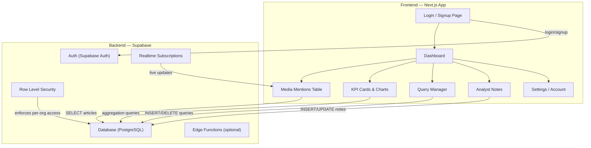

# Canary Data — Custom SaaS Migration Plan

Migrate from a HighLevel funnel page with embedded Looker Studio dashboards to a fully custom-coded SaaS application with authentication, custom dashboards, and a polished UI.

## Current State (What You Have Today)

````carousel

<!-- slide -->

````

| Layer | Current Tool | Problems |
|-------|-------------|----------|
| **Hosting / Pages** | GoHighLevel funnel | No real auth, clunky page builder, `/untitled-page` URL |
| **Dashboards** | Looker Studio embed | Not customizable, slow loading iframe, breaks mobile |
| **Backend / DB** | Supabase | ✅ Keep — solid choice |
| **Query Management** | GHL forms → webhooks | Fragile, no validation, no user context |
| **Analyst Notes** | GHL forms → webhooks | Clunky UX, requires leaving dashboard |

---

## User Review Required

> [!IMPORTANT]
> **Supabase Schema Access Needed**: Before I begin coding, I need access to or a description of your current Supabase tables. Specifically:
> - What tables exist? (articles, queries, notes, users, etc.)
> - What columns does each table have?
> - How do you currently ingest articles — is there a cron job, webhook, or third-party scraper?

> [!IMPORTANT]
> **Authentication Model**: How do your current users access the dashboard?
> - Do they all share one link, or does each client get their own?
> - Is there a concept of "organizations" or "teams" (e.g., one school district = one account)?
> - Should new users be able to self-register, or are accounts invite-only?

> [!WARNING]
> **Domain & Hosting**: The new app will need to be deployed somewhere.
> - Do you want to keep `canarydata.media` as the domain?
> - Are you open to hosting on **Vercel** (free tier works great for Next.js)?
> - Or do you prefer a different hosting provider?

---

## Proposed Architecture



---

## Proposed Changes

### Phase 1: Project Setup & Auth

#### [NEW] Next.js App Scaffold
- Initialize a Next.js 15 app with App Router in `/Users/dustintrout/Documents/Antigravity/Canary Data`
- Install dependencies: `@supabase/supabase-js`, `@supabase/ssr`, `recharts` (for charts), plus dev tooling
- Set up the design system: CSS custom properties for the Canary Data brand (dark navy, canary yellow, green accents)
- Font: **Plus Jakarta Sans** (matching current branding)

#### [NEW] Supabase Auth Integration
- Configure Supabase Auth with email/password login
- Create login and signup pages with polished UI
- Middleware-based route protection (redirect unauthenticated users to `/login`)
- Session management via `@supabase/ssr`

#### [NEW] Layout & Navigation
- Sidebar navigation with: Dashboard, Queries, Notes, Settings
- Top bar with user avatar, org name, and logout
- Mobile-responsive hamburger menu

---

### Phase 2: Custom Dashboard (Replace Looker Studio)

#### [NEW] KPI Cards
Replace the Looker Studio KPIs with custom components:
- **Published Articles** — count with sparkline trend chart
- **Canary Health Score** — gauge visualization (like the current speedometer)
- **Trend Arrow** — percentage change indicator

#### [NEW] Articles Data Table
Replace the Looker Studio data table with a custom, interactive table:
- Columns: Date, Headline, Summary, Link, Notes, Canary Score
- Sortable columns (click headers)
- Filterable by: Canary Score range, Source Category, Perch Tag, Date Range
- Pagination (matching current 5-per-page or configurable)
- "Add Note" action directly inline (no page navigation needed)
- Clickable external links to source articles
- Color-coded Canary Score badges (green/yellow/red)

#### [NEW] Charts & Visualizations
Using **Recharts** for custom charts:
- Mention volume over time (line/bar chart)
- Sentiment distribution (pie/donut chart)
- Source breakdown (horizontal bar chart)
- Score trend line

---

### Phase 3: Query Management (Replace GHL Forms)

#### [NEW] Query Manager Page
- View all active search queries in a clean list/card layout
- Add new queries with a proper form + validation
- Delete queries with confirmation dialog
- Bulk operations (delete multiple)
- Real-time feedback: success/error toasts
- Direct Supabase mutations (no more webhook fragility)

---

### Phase 4: Analyst Notes (Replace GHL Forms)

#### [NEW] Notes System
- Inline note editing directly on the articles table (click to add note)
- Full notes view/history on a dedicated page
- Rich text or markdown support (optional)
- Timestamps and author attribution
- Filter/search notes

---

### Phase 5: Polish & Deploy

#### Settings Page
- User profile (name, email, password change)
- Organization settings (if applicable)
- Notification preferences (future)

#### Deployment
- Deploy to Vercel (or preferred host)
- Point `canarydata.media` DNS to new deployment
- Set up environment variables (Supabase URL, anon key)

---

## Tech Stack Summary

| Layer | Technology | Why |
|-------|-----------|-----|
| **Framework** | Next.js 15 (App Router) | SSR, API routes, file-based routing, excellent DX |
| **Styling** | Vanilla CSS with custom properties | Full control, dark-mode design system, no framework bloat |
| **Auth** | Supabase Auth | Already have Supabase, built-in RLS integration |
| **Database** | Supabase PostgreSQL | Already in use — no migration needed |
| **Charts** | Recharts | Lightweight, React-native, highly customizable |
| **Hosting** | Vercel | Free tier, perfect Next.js integration, edge functions |
| **Font** | Plus Jakarta Sans (Google Fonts) | Matches current branding |

---

## Open Questions

> [!IMPORTANT]
> 1. **Can you share your Supabase project URL and table schema?** (I need to know what data I'm working with to design the queries and dashboard correctly.)

> [!IMPORTANT]
> 2. **How are articles currently ingested?** Is there a scraper, API integration, or manual process that writes to Supabase? This won't change — I just need to understand it so the new dashboard reads from the right tables.

> [!IMPORTANT]
> 3. **Multi-tenant or single-tenant?** Does each customer get their own dashboard with their own data, or is this currently a single shared instance? This affects whether we need Row Level Security and organization-based data isolation.

4. **What's the "Canary Score" formula?** Is it computed in Looker Studio, stored in Supabase, or calculated elsewhere? I need to replicate it.

5. **"Perch Tag" and "Source Category"** — are these predefined categories or user-created? Where do they come from?

6. **Do you have a logo file** (SVG/PNG) I can use, or should I recreate the yellow bird icon?

---

## Verification Plan

### Automated Tests
- Run `npm run build` to verify no type/build errors
- Verify Supabase auth flow works end-to-end in the browser
- Test all CRUD operations (queries, notes) against Supabase

### Manual Verification
- Side-by-side comparison: old Looker Studio data vs. new custom dashboard
- Test login → dashboard → add query → view article → add note flow
- Mobile responsiveness testing
- Performance comparison (page load time vs. Looker Studio iframe)

### Browser Testing
- Use browser tool to walk through the full user flow
- Capture screenshots at each step for verification
